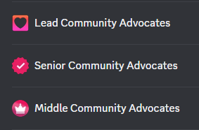

# ❤ Community Advocate

As a Community Advocate, you will drive our community's growth, involvement, and knowledge of protocol. Your role is to proactively engage our community members across various platforms. You need to actively participate, share insights, teach, and help members see the value and potential of Eonian. Your advocacy will play a crucial role in building an educated and enthusiastic community.

## **Prestige and Rewards at Every Level**

Embrace the journey through three prestigious levels of Community Advocacy, each offering escalating rewards and recognition

| Rewards                                                      | Middle Community Advocate | Senior Community Advocate | Lead Community Advocate |
| ------------------------------------------------------------ | ------------------------- | ------------------------- | ----------------------- |
| 💎 Prestige Role and Badge                                   | ✅                         | ✅                         | ✅                       |
| 🗝️ Entry Ambassadors' Channel Access                        | ✅                         | ✅                         | ✅                       |
| 🚀 Eligible for Retrodrop                                    | ✅                         | ✅                         | ✅                       |
| 🔓 Exclusive early access to our products                    | ✅                         | ✅                         | ✅                       |
| 📰 Early Insights and News                                   | ✅                         | ✅                         | ✅                       |
| 🏆 Zealy XP Reward                                           | 5 000xp                   | 10 000xp/month            | 15 000xp/month          |
| 📢 Senior Advocates' Channel Access                          | ✖️                        | ✅                         | ✅                       |
| 🌐 Social Network Exposure                                   | ✖️                        | ✅                         | ✅                       |
| 🎁 Exclusive Contests & Airdrops                             | ✖️                        | ✅                         | ✅                       |
| 🌐 Real-world experience and work with our professional team | ✖️                        | ✅                         | ✅                       |
| 🤝 Build Professional Network                                | ✖️                        | ✅                         | ✅                       |
| 🌍 Showcasing on Our Website                                 | ✖️                        | ✅                         | ✅                       |
| 💼 Full-Time Career Opportunities                            | ✖️                        | ✖️                        | ✅                       |
| 🛠️ Get a leg up when applying to new opportunities          | ✖️                        | ✖️                        | ✅                       |
| ⚖️ Higher Suggestions Priority                               | ✖️                        | ✖️                        | ✅                       |

### **Unique Badge**

You will get an exclusive Community Advocate Badge in our Discord, which showcases your prestige level in our community.

<figure><figcaption></figcaption></figure>

## **Activities at Each Level**

### **Middle Community Advocate**

Middle Community Advocate include activities of Entry Ambassador in addition to

* 📢 Amplify Eonian news and posts on Twitter.
* 💬 Foster engaging and insightful discussions in our Discord community.
* 🧠 Demonstrate your Eonian knowledge by passing our specialized quiz.

### **Senior Community Advocate**

Senior Community Advocate activities include activities of Middle Community Advocate in addition to

* 🌍 Engage with Eonian news and posts across their social media pages, including Twitter, Medium, and Telegram.
* 🗨️ Actively participate and interact in Discord and Twitter discussions, in our meetups and AMAs, answering questions and contributing insights.
* 🌟 Engage and interact with the community. Encourage meaningful conversations and positive interactions within the community and during events.
* 🌐 Help us moderate channels and online communities in various languages.

### **Lead Community Advocate**

Lead Community Advocate activities include activities of Senior Community Advocate in addition to:

* 📊 Gather and share opinions, suggestions, insights, and feedback to contribute to the growth of Eonian.
* 📣 Relay and translate announcements, tweets, and general channels
* 🕊️ Manage and resolve conflicts and escalated issues
* 📆 Help support and manage AMA sessions and other events
* 🎓Train other moderators for superior community management.

To grow to this level, it is important to show such qualities:

* 🕊️ Effective conflict resolution
* 📈Ensure persistent monitoring of assigned channels
