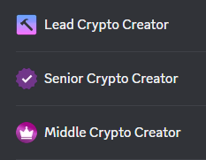

# 🖌 The Creator

As The Creator for Eonian, you are at the forefront of our storytelling and brand representation. Your role is pivotal in crafting engaging, informative, high-quality content that resonates with our audience and reflects the essence of Eonian and its products.

## **Three Levels of Creative Influence**

Embark on a creative journey through three levels of The Creator, each unlocking new avenues of expression and reward.

1. **Middle Creator -** Start by producing captivating content and sharing it across platforms.
2. **Senior Creator -** Build on your influence with strategic content creation and collaborations.
3. **Lead Creator -** Lead the creative direction, mentor upcoming creators, and have a significant say in our content strategy.

## **Prestige and Rewards at Every Level**

Embrace the journey through three prestigious levels of the Creator role, each offering escalating rewards and recognition

| Rewards                                                      | Middle Creator | Senior Creator | Lead Creator   |
| ------------------------------------------------------------ | -------------- | -------------- | -------------- |
| 💎 Prestige Role                                             | ✅              | ✅              | ✅              |
| 🗝️ Entry Ambassadors' Channel Access                        | ✅              | ✅              | ✅              |
| 🚀 Eligible for Retrodrop                                    | ✅              | ✅              | ✅              |
| 🔓 Exclusive early access to our products                    | ✅              | ✅              | ✅              |
| 📰 Early Insights and News                                   | ✅              | ✅              | ✅              |
| 🏆 Zealy XP Reward                                           | 5 000xp        | 10 000xp/month | 15 000xp/month |
| 📢 Advocates' Channel Access                                 | ✖️             | ✅              | ✅              |
| 🌐 Social Network Exposure                                   | ✖️             | ✅              | ✅              |
| 🎁 Exclusive Contests & Airdrops                             | ✖️             | ✅              | ✅              |
| 🌐 Real-world experience and work with our professional team | ✖️             | ✅              | ✅              |
| 🤝 Build Professional Network                                | ✖️             | ✅              | ✅              |
| 🌍 Showcasing on Our Website                                 | ✖️             | ✅              | ✅              |
| 💼 Full-Time Career Opportunities                            | ✖️             | ✖️             | ✅              |
| 🛠️ Get a leg up when applying to new opportunities          | ✖️             | ✖️             | ✅              |
| ⚖️ Higher Suggestions Priority                               | ✖️             | ✖️             | ✅              |

### **Unique Badge**

You will get an exclusive Creator Badge in our Discord, which showcases your prestige level in our community.

<figure><figcaption></figcaption></figure>

## **Activities at Each Level**

### **Middle Creator**

Middle Crypto Evangelist includes activities of Entry Ambassador in addition to

* 🎨 Create and publish high-quality blog posts, videos, tweets, infographics, or anything else at what you are the best! We will provide a platform and guidance for you to maximize your creations’ exposure. And we will help you build your own follower base.
* 🗨️ Share your work on social media to amplify Eonian’s reach.

### **Senior Creator**

Senior Creator activities include activities of Middle Creator in addition to

* 🎨 Create content on different promising themes.
* 🌍 Translate existing content in the languages that you know. This is the best way to reach a new audience for the community and the best way for you to build a name as an expert in the local community!
* 🚀 Collaborate with Eonian's content team to create a content strategy.
* 🧠 Participate in content brainstorming sessions
* 📝 Provide constructive feedback to fellow creators.

### **Lead Creator**

Lead Creator activities include activities of Senior Creator in addition to

* 🎓 Mentor and train emerging content creators within Eonian.
* ✅ Oversee and approve content submissions from the team.
* 📈 Coordinate with Eonian’s content team to shape the overall content strategy.

To grow to this level important to show such qualities

* 🌱 Foster a network among content creators.
* 📣 Communicate effectively and maintain a consistent quality of content.
