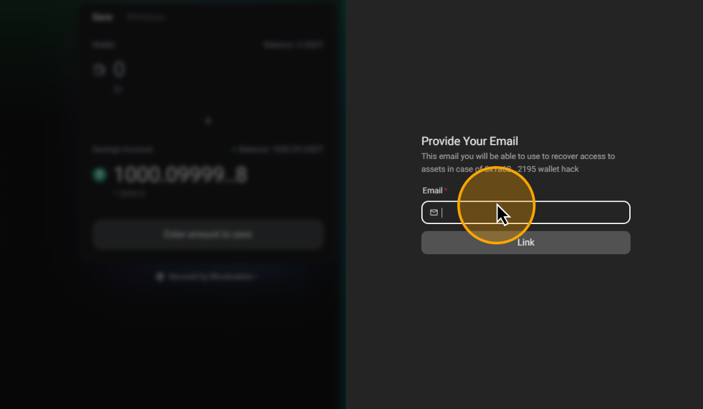
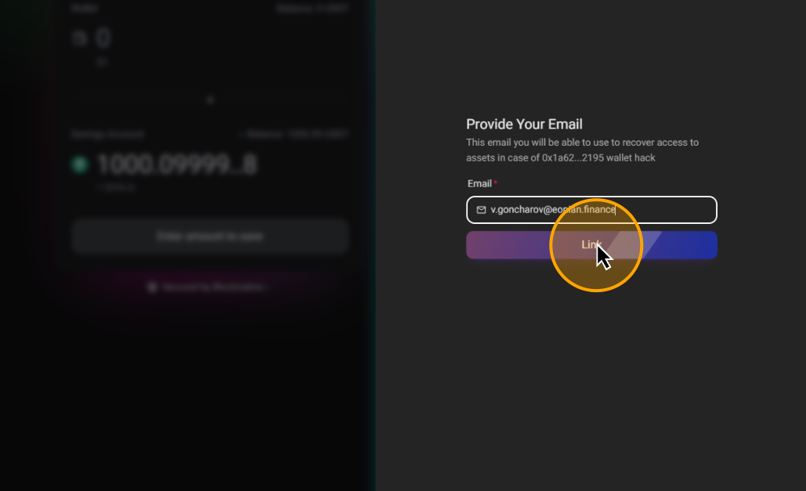
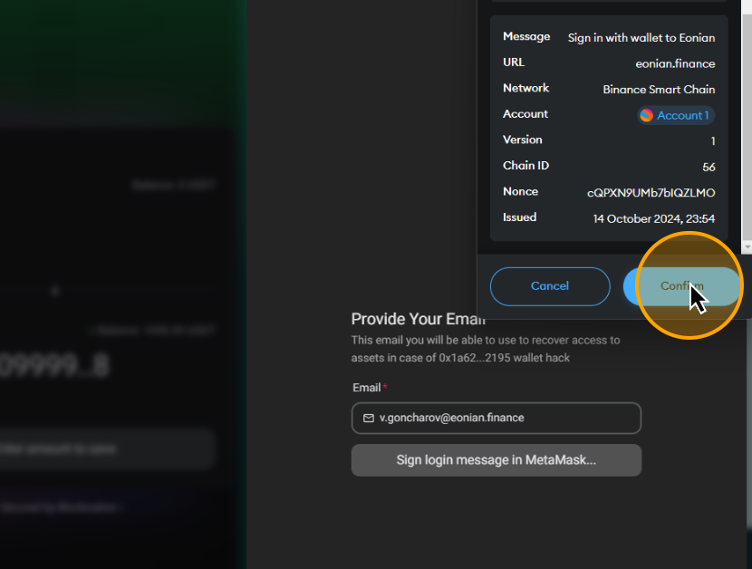

# 🛡️ How to Enable Insurance

To insure your savings, you first need to deposit your crypto into the Eonian protocol and then link your wallet and email. If you have not yet deposited assets, you can do it [through this guide](start-to-earn-crypto.md).

## Open any Eonian Vault

[Open Eonian](https://eonian.finance/earn), choose any Vault and connect your wallet.

<figure><figcaption></figcaption></figure>

## Click on "Link email"

<figure><figcaption></figcaption></figure>

## Input Email

Click on the email input

<figure><figcaption></figcaption></figure>

Input your email and click "Link"

<figure><figcaption></figcaption></figure>

## Sign email linking

Click "Confirm" in your wallet.

<figure><figcaption></figcaption></figure>

## Congratulations

Now, your wallet and assets saved in the protocol are insured. In case someone hacks your wallet or you lose access to your assets, you can write to [care@eonian.finance](mailto:care@eonian.finance) to start the verification process.

We will guide you through this process via email. After the verification process is finished, your assets will be returned to the new wallet that you prefer.
