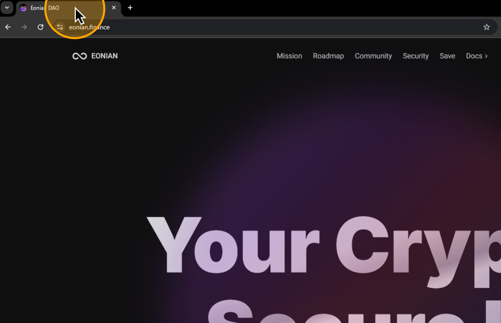

# 🤗 How to Deposit Crypto

To insure your savings, you first need to deposit your crypto into the Eonian protocol. This way, you will save it in insured storage, which generates interest on your savings. After completing this guide, you will be able to enable insurance for deposited assets.

## **Go to Eonian**

### Visit [the Eonian protocol](https://eonian.finance/) website.

<figure><figcaption></figcaption></figure>

### Click on "Save"

<figure><figcaption></figcaption></figure>

## **Choose Token**

Choose the cryptocurrency that you have in your wallet.&#x20;

### Click "Save" on your token card

<figure><figcaption></figcaption></figure>

## **Connect Your Wallet**

Connecting your wallet to the Eonian application is crucial for the process. This connection facilitates the deposit and withdrawal of your tokens.

### Click on "Connect wallet"

<figure><figcaption></figcaption></figure>

### Choose your wallet

Choose the way to connect your wallet in the popup. If you have a wallet extension installed in your browser, it will be displayed in a popup. Simply click on it.&#x20;


If the wallet is not displayed or you use a mobile wallet, click WalletConnect. It provides support for multiple desktop or mobile wallets. For a mobile wallet, you need to scan the QR code displayed on the screen to connect it.


<figure><figcaption></figcaption></figure>

### Approve connect

Approve a connect request in your wallet to successfully link your wallet to the dApp.

## **Deposit Tokens**

Now, you're set to deposit your tokens.

### Choose the amount to deposit

Decide on the number of tokens you want to deposit and input this number into the provided field. Or simply click on the percent under the input.

<figure><figcaption></figcaption></figure>

### Click "Save"

After entering the number, click the "Save" button.

<figure><figcaption></figcaption></figure>

### Approve Transactions

You will then need to approve two transactions. The deposit process is split into two parts to ensure its safety.

#### Confirm the Allowance transaction.

<figure><figcaption></figcaption></figure>

#### Confirm the Deposit transaction.

<figure><figcaption></figcaption></figure>

## **Next Steps**

<figure><figcaption></figcaption></figure>

After the successful deposit of your tokens, Eonian takes the lead. Your tokens will strategically lend your assets in various DeFi protocols, yielding returns over time. You can see projected returns on the right chart.

### Enable Insurance

Now, you need to enable wallet insurance by linking your email. As a result, if someone hacks your wallet, you will be able to recover access to your wallet through email or get reimbursement if a hacker is able to steal your assets.
