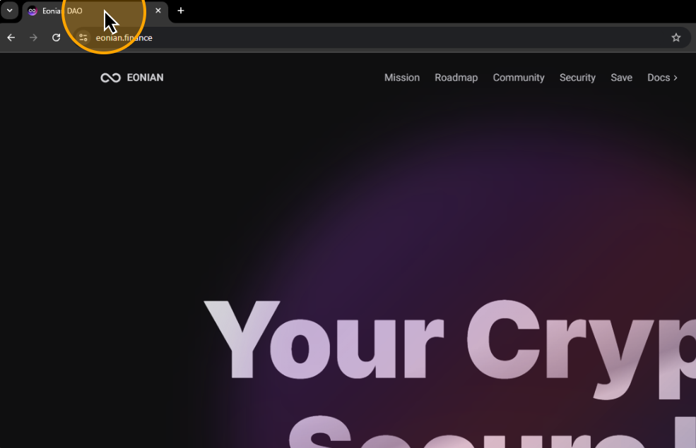
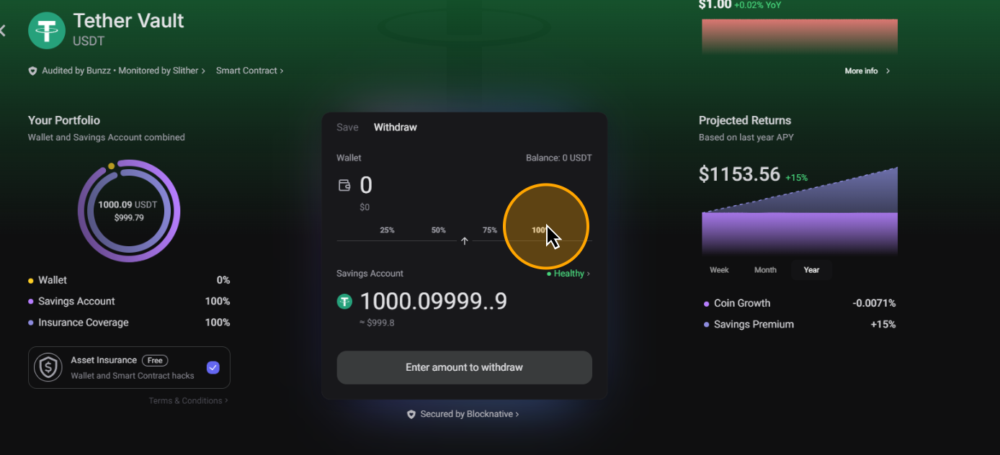
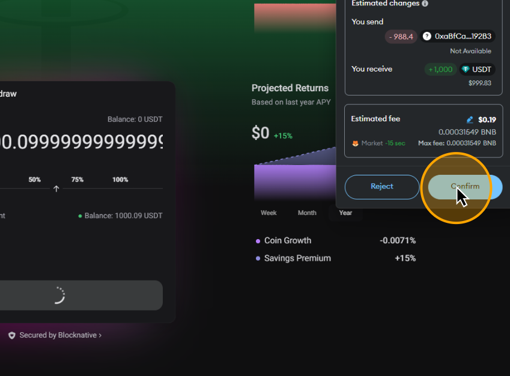

# 🍰 How to Withdraw Crypto

When you decide to withdraw your tokens, navigate back to the Eonian.

## **Go to Eonian**

### Visit [the Eonian protocol](https://eonian.finance/) website.

<figure><figcaption></figcaption></figure>

### Click on "Save"

<figure><figcaption></figcaption></figure>

## **Choose Token**

Choose the cryptocurrency that you have in your wallet.&#x20;

### Click "Save" on your token card

<figure><figcaption></figcaption></figure>

## **Connect Your Wallet**

Connecting your wallet to the Eonian application is crucial for the process. This connection facilitates the deposit and withdrawal of your tokens.

### Click on "Connect wallet"

<figure><figcaption></figcaption></figure>

### Choose your wallet

Choose the way to connect your wallet in the popup. If you have a wallet extension installed in your browser, it will be displayed in a popup. Simply click on it.&#x20;


If the wallet is not displayed or you use a mobile wallet, click WalletConnect. It provides support for multiple desktop or mobile wallets. For a mobile wallet, you need to scan the QR code displayed on the screen to connect it.


<figure><figcaption></figcaption></figure>

### Approve connect

Approve a connect request in your wallet to successfully link your wallet to the dApp.

## Click on the "Withdraw" tab

<figure><figcaption></figcaption></figure>

## Choose the amount to withdraw

Input the amount of tokens you wish to withdraw or click on percent.

<figure><figcaption></figcaption></figure>

## Click on the "Withdraw" button

<figure><figcaption></figcaption></figure>

## Confirm withdrawal transaction

Click on "Confirm" in your wallet.

<figure><figcaption></figcaption></figure>

## Congratulations

Once the transaction is confirmed and processed, your tokens will be returned to your wallet.
