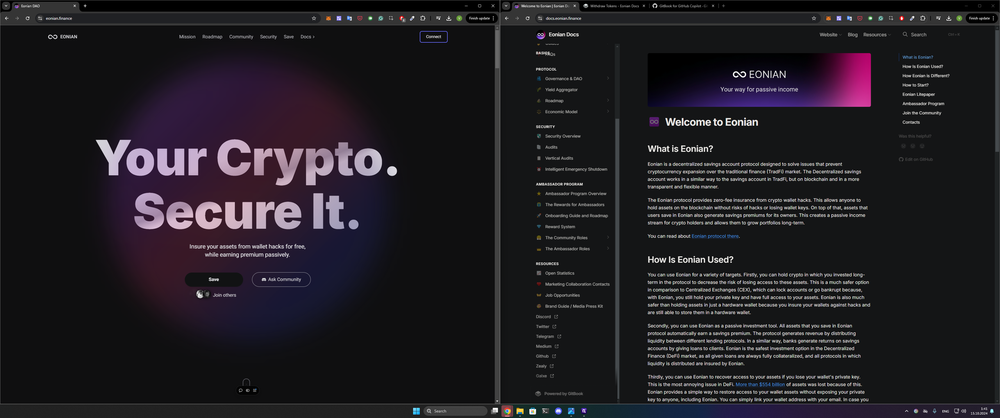

# 🛡 The Eonian Protocol

### Introduction

Cryptocurrency adoption is surging, but with increased adoption comes increased risk. Cybercriminals stole a staggering $3.8 billion in cryptocurrency in 2022, representing a 15% increase over the previous year, according to a report from [Chainalysis](https://www.chainalysis.com/blog/2022-biggest-year-ever-for-crypto-hacking/). In these assets, the percentage of money received by wallet hacks is on the rise every year. The Eonian Savings Account aims to be the bulwark against such threats, providing zero-fee insurance for your assets with the added perk of returns on your savings.

## The Problem

<figure><figcaption></figcaption></figure>

Crypto wallets, despite being known as one of the safer options for crypto storage, are not immune to hacks. There have been many cases where assets lying dormant in wallets for years were stolen without any interaction from the owner. This is supplemented by [the large-scale hacks involving popular wallets like MetaMask and TrustWallet](https://www.notion.so/Crypto-Wallet-Hacks-List-a9d7e06d75dc4b328f392bfed38ccb4a?pvs=21).

Only in 2022 alone did [crypto hack revenue hit $3.8 billion](https://go.chainalysis.com/2023-crypto-crime-report.html). Almost all of it is coming from DeFi and crypto wallet hacks. But the problem with wallet hacks is actually more critical than with DeFi protocols and contains not in the risk of hacks itself but rather in the response from wallet developers.

Biggest DeFi protocols, when hacked, often attempt to reimburse users by utilizing insurance, loans, bonds, or the project budget itself. Wallet providers, in contrast, frequently eschew responsibility. They usually try to blame users for losing the key and disagree with making any reimbursements.

The grim reality is that, in many wallet hack cases, wallet developers, despite being aware of the situation, have neither taken responsibility nor made amends to return the stolen funds or at least develop proof that they will not be hacked again. This situation underscores a dire need for asset protection.

## The Solution

The Eonian Decentralized Savings Account offers an innovative solution to this pervasive issue. The protocol provides insurance against technical hacks of hot, cold, and hardware wallets. Distinctively, if your assets are maliciously withdrawn or if you lose your private key, Eonian ensures that your funds are returned. At its core, the solution functions via smart contract protocol. Based on similar smart contracts technology, working tokens like USDT and WETH.

You can think of our decentralized savings account as a bank savings account but on the chain. Assets stored there will be used in a similar way as in a bank but fully automated and independent from any human operations through smart contracts. These smart contracts will provide liquidity (in other terms, give “loans”) to different protocols and use revenue from these protocols to fill the insurance pool and pay users’ premiums for holding their assets in the savings account.

<figure><figcaption></figcaption></figure>

The main difference of the savings account protocol protection system is the user email, serving as a 2FA channel. This email allows users to lock or recover access to assets in the unfortunate event of a hack or lost access. Through this email, the user can provide a new wallet address to which we can send reimbursement or transfer money from an old wallet that is no longer accessible.
